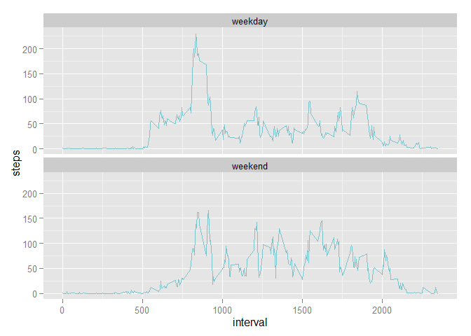

# Reproducible Research: Peer Assessment 1

This report will analyze data recorded by a personal activity monitoring
device.  The code below assumes that the necessary data has already been
downloaded and extracted into the working directory.  If you do not already
have a copy of the data, you can download it from:  
&nbsp;&nbsp;&nbsp;&nbsp;&nbsp;&nbsp;[https://d396qusza40orc.cloudfront.net/repdata%2Fdata%2Factivity.zip](https://d396qusza40orc.cloudfront.net/repdata%2Fdata%2Factivity.zip)


## Loading and preprocessing the data
To load the data, we can use the `read.csv` function.  We'll store the data in
a data frame called `activity`.

```r
activity <- read.csv("activity.csv")
```

By default, R will read the `date` column as a factor instead of as a Date
object.  To make the data easier to process, we can convert it to a Date
object like so:

```r
activity$date <- as.Date(activity$date, format="%Y-%m-%d")
```

Now that the data is loaded and formatted for use, we can begin our analysis.

## What is mean total number of steps taken per day?
For this part of the analysis, we will ignore any `NA` values.  Our first task
is to calculate the total number of steps taken per day.  This is fairly
straight-forward with the help of the `dplyr` package.  We'll store the daily
summary in a new data frame called `totals`.

```r
library(dplyr)
totals <- group_by(activity, date) %>% summarise(steps = sum(steps, na.rm = TRUE))
```

To help us quickly visualize how many steps per day are being taken, we can make
a simple histogram.

```r
hist(totals$steps,
     main="Histogram of Total Steps Per Day",
     xlab="Total Steps Per Day",
     c="cadetblue3")
```

 

Now we can answer the first question of our analysis:  What is the mean total
steps taken per day?

```r
mean(totals$steps)
```

```
## [1] 9354.23
```

And, just for the sake of completeness, we can also check the median total
steps taken per day.

```r
median(totals$steps)
```

```
## [1] 10395
```

## What is the average daily activity pattern?
Next we'll examine the daily activity pattern.  For this, we want to compute the
average number of steps taken within each 5-minute interval across all of the
days in the data set.

Once again, this computation is fairly straight-forward using `dplyr`.  As in
the previous section, we'll ignore any `NA` values.


```r
intervals <- group_by(activity, interval) %>% summarise(steps = mean(steps, na.rm = TRUE))
```

We'll use a time-series plot to helps visualize this data.

```r
plot(intervals$interval, intervals$steps,
     main="Average Steps Taken in Each Interval",
     xlab="Interval",
     ylab="Number of Steps",
     type="l",
     col="cadetblue3")
```

 

Which of the 5-minute intervals has the highest average number of steps?

```r
intervals[which(intervals$steps == max(intervals$steps)),]
```

```
## Source: local data frame [1 x 2]
## 
##   interval    steps
## 1      835 206.1698
```

## Imputing missing values
So far in this analysis, we've been ignoring the `NA` values in the `steps`
column.  It's possible that this could introduce bias into some of our
calculations.  So let's first see how many `NA` values we're dealing with.

```r
sum(is.na(activity$steps))
```

```
## [1] 2304
```

We'll use a simple stategy to impute the missing values.  We'll replace all of
the `NA` values with the average number of steps in that same interval across
all of the days.  However, we don't want to overwrite our original data.
Instead, we'll make a copy of the original called `activity.imp` and use that
copy to impute the missing values.

```r
activity.imp <- activity

getAverageStepsForInterval <- function(i) {
    intervals$steps[which(intervals$interval == i)]
}

activity.imp[which(is.na(activity.imp$steps)), 1] <-
    sapply(activity.imp[which(is.na(activity.imp$steps)),3], getAverageStepsForInterval)
```

Let's be sure that our new data frame does not have any missing values.

```r
sum(is.na(activity.imp$steps))
```

```
## [1] 0
```

Looks like we were successful!  So how do these imputed values affect our data
set?  Let's run some of the same analysis we ran earlier our new data frame
so we can compare.  We'll start by computing the total steps taken per day.

```r
totals.imp <- group_by(activity.imp, date) %>% summarise(steps = sum(steps))
```

Now let's remake our histogram using the imputed values.

```r
hist(totals.imp$steps,
     main="Histogram of Total Steps Per Day",
     xlab="Total Steps Per Day",
     c="cadetblue3")
```

 

What is the mean total steps per day when using our imputed values?

```r
mean(totals.imp$steps)
```

```
## [1] 10766.19
```

What is the median total steps per day when using our imputed values?

```r
median(totals.imp$steps)
```

```
## [1] 10766.19
```

As expected, the imputed values have altered our computations. The mean
increased by 1412
steps, which is an increase of
15.09%.  The values in the histogram have clearly shifted towards the middle bin.

## Are there differences in activity patterns between weekdays and weekends?
For the final part of our analysis, we'll compare the activity on weekdays to
the activity on weekends.  For this analysis, we'll use the data frame that has
filled in the missing values.

First, let's augment our data frame with a factor column that tell us whether the
day is a weekday or part of the weekend.

```r
activity.imp$weekday <-
    factor(ifelse(grepl("Saturday|Sunday", weekdays(activity.imp$date)), "weekend", "weekday"))
```

We will conclude with a panel plot with time series plots that compare the
average steps in each interval between weekdays and weekends.  First, we need
to make a summary by weekday and interval based on our imputed values.

```r
intervals.imp <- group_by(activity.imp, weekday, interval) %>%
                 summarise(steps = mean(steps))
```

Now we can make our plot.

```r
library(ggplot2)
ggplot(intervals.imp, aes(x=interval, y=steps)) +
    geom_line(col="cadetblue3") +
    facet_wrap( ~ weekday, ncol=1)
```

 
